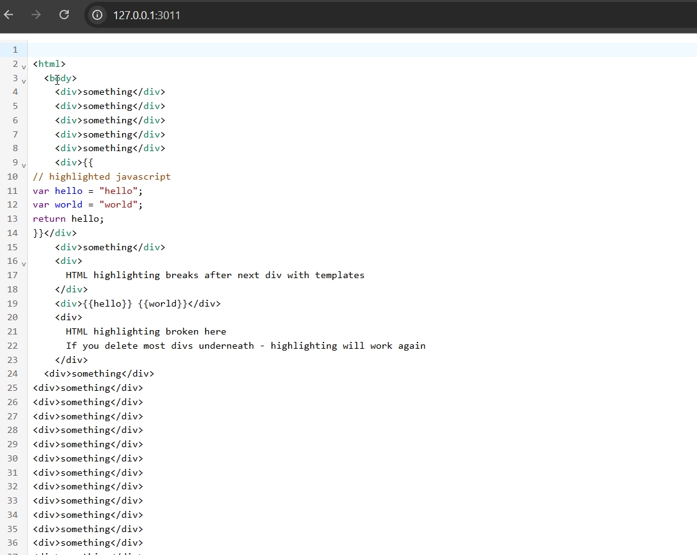
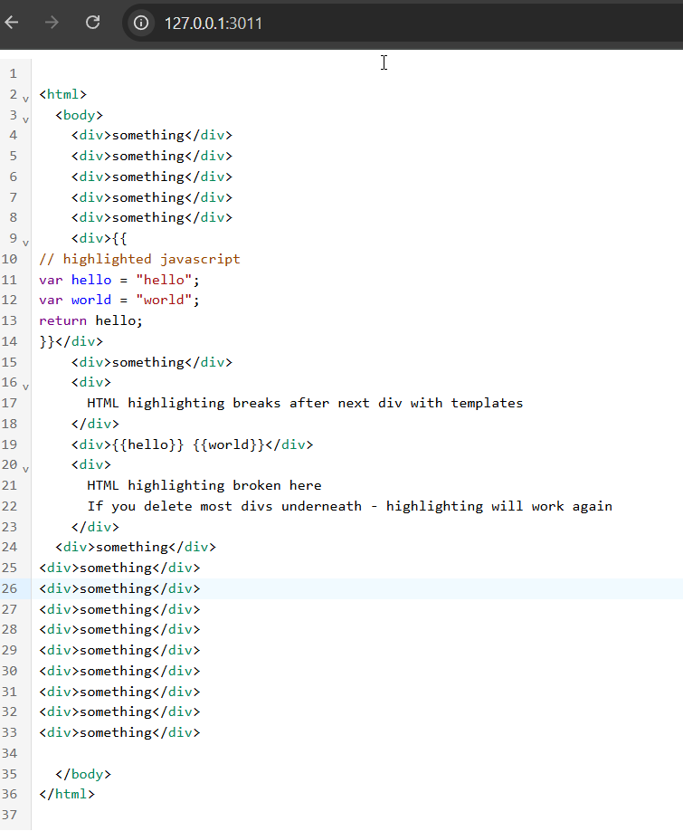

# lezer-overlay-problem
repo for lezer-parser overlay premature stop problem

Run npm install && npm start

Open 127.0.0.1:3011

When you have many divs - highlighting breaks

If you have not so many divs - highlighting works
